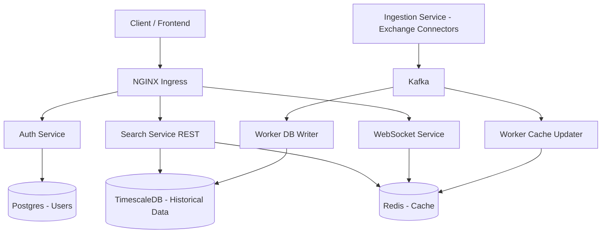

# Coinstrove

> **Work in Progress: Major architecture refactoring ongoing**

Coinstrove is a real-time cryptocurrency data platform that provides:

- Live streaming prices (WebSocket)
- Historical search & analytics (REST API)
- User personalization (watchlists, preferences)
- High-performance data ingestion pipeline

---

# System Overview

Coinstrove is designed as a **scalable, event-driven system** with clear separation between:

- Data ingestion
- Processing
- Storage
- Delivery

---

# Architecture



---

# Core Components

## Auth Service
- User signup & login
- JWT-based authentication
- Email verification
- User roles & plans

---

## Search Service (REST API)
- Coin search
- Lowest price queries
- Historical price data
- Watchlist management

---

## WebSocket Service
- Real-time price streaming
- Public (no login) + authenticated users
- Uses Redis for low-latency data

---

## Ingestion Service
- Connects to external exchanges (Binance, etc.)
- Streams real-time price updates
- Publishes events to Kafka

---

## Workers
Background services that process Kafka events:

### DB Writer
- Stores price data in TimescaleDB

### Cache Updater
- Updates Redis with latest prices

---

## Storage Layer

### TimescaleDB
- Time-series database for historical data
- Optimized for queries like:
  - price history
  - aggregations

### Redis
- Fast in-memory cache
- Used for:
  - latest price lookup
  - WebSocket streaming

### PostgreSQL
- Stores user data
- Auth-related tables

---

# Data Flow

```
Exchange → Ingestion Service → Kafka → Workers → DB + Cache
                                         ↓
                                API / WebSocket
                                         ↓
                                       Client
```

---

# Authentication & Authorization

- JWT-based authentication
- Public endpoints available (no login required)
- Protected endpoints require token
- Role & plan-based authorization

---

# Rate Limiting Strategy

- Public users → IP-based limits
- Authenticated users → plan-based limits
- Enforced at service level (can be extended to ingress)

---

# Scalability

## Horizontal Scaling
- Search, WebSocket, Workers → Kubernetes Deployments
- Scaled using HPA (CPU / traffic / queue lag)

## Data Pipeline Scaling
- Kafka partitions → parallel processing
- Workers scale with consumer groups

## Database Scaling
- TimescaleDB → partitioning + read replicas
- Redis → caching layer reduces DB load

---

# Tech Stack

- **Language:** Go
- **Messaging:** Kafka
- **Database:** TimescaleDB (Postgres)
- **Cache:** Redis
- **Orchestration:** Kubernetes
- **Ingress:** NGINX

---

# Future Improvements

- API key system (for external developers)
- Advanced analytics (candlesticks, indicators)
- Alert system (price triggers)
- Multi-region deployment
- ClickHouse integration for analytics

---

# Key Design Principles

- Event-driven architecture
- Separation of concerns
- Stateless service scaling
- Async processing with workers
- Cache-first real-time delivery

---

# Status

Currently refactoring architecture to support:

- Kafka-based ingestion
- Distributed workers
- Scalable real-time streaming

---

# Contributing

Contributions, suggestions, and discussions are welcome!

---

# Author

Built with ❤️ by Umar Farooq
